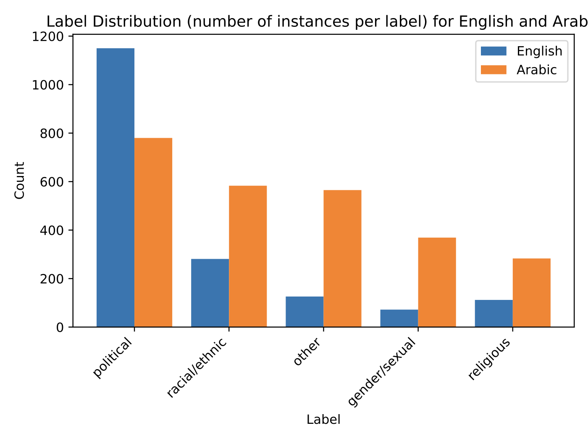
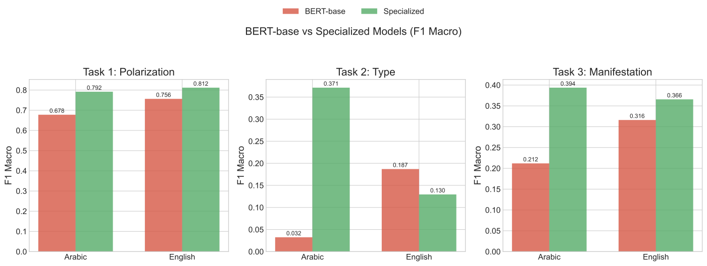
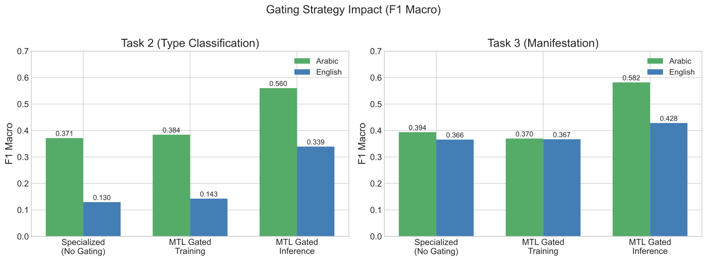
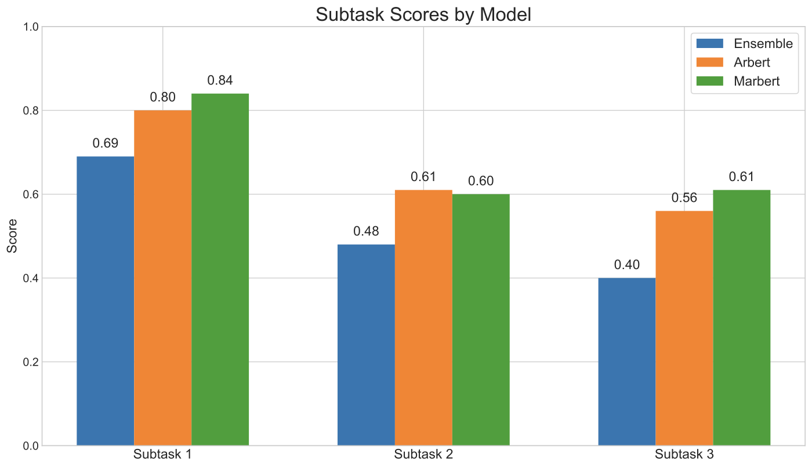

## SemEval-2026 Task 9

Multilingual polarization detection (Arabic + English) across three linked subtasks:
- Subtask 1: binary polarized vs. non‑polarized.
- Subtask 2: multi-label type (political, racial/ethnic, religious, gender/sexual, other).
- Subtask 3: multi-label manifestation (stereotype, vilification, dehumanization, extreme language, lack of empathy, invalidation).

## What’s in this repo
- `src/`: multitask model, training, thresholds, metrics, prediction.
- `DSPY/`: Notebooks for DSPY prompting
- `dspy_cache/`: MIPROv2 optimized DSPY programs
- `figures/`: plots used in the paper (label skew, gating, dialectness, model selection).

## Approach
- Shared encoder MTL (MARBERTv2 for Arabic; hate-speech RoBERTa for English) with three heads.
- Inference-time hard gating: Subtask 1 mask zeros Subtasks 2–3 outputs for non‑polarized texts.
- Class-weighted BCE; grid-searched per-label thresholds (helps English).
- Data augmentation: ~15% Arabic paraphrased; English left as-is.
- Baselines: single-task fine-tuning and DSPy prompting/optimization—both trail the gated encoder.

## Data highlights
- ~3.4k AR / ~3.2k EN train; Codabench dev used as test.
- English: strong skew (non-polarized dominant; political label dominates Subtask 2).  
  
- Arabic: mix of MSA and dialectal text; dialectness mostly low.  
  

## Model insights
- Domain-specialized encoders win: MARBERTv2 (AR) and hate-speech RoBERTa (EN).  
  
- Inference gating beats no/ training-time gating for subtasks 2–3.  
  
- ARBERT–MARBERT ensemble via ALDi routing underperforms MARBERT alone.  
  

## Headline results (F1 Macro, dev as test)
(as of 16/12/2025)
- Subtask 1: 0.839 (AR) / 0.842 (EN): ranked 1st in Arabic
- Subtask 2: 0.596 (AR) / 0.449 (EN): ranked 5th in Arabic
- Subtask 3: 0.607 (AR) / 0.496 (EN): ranked 2nd in Arabic